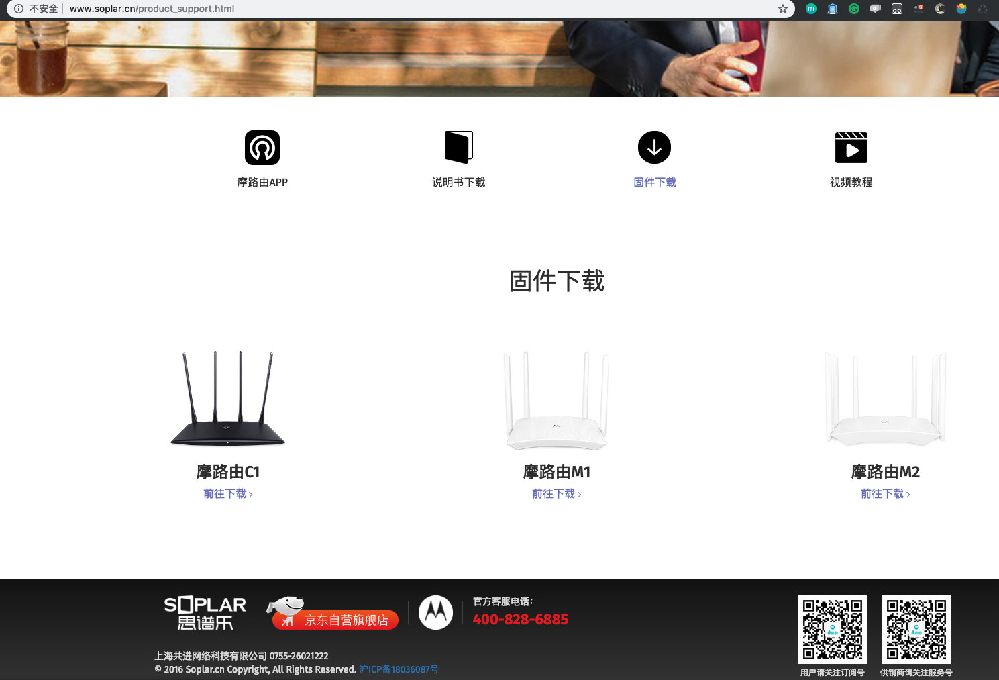
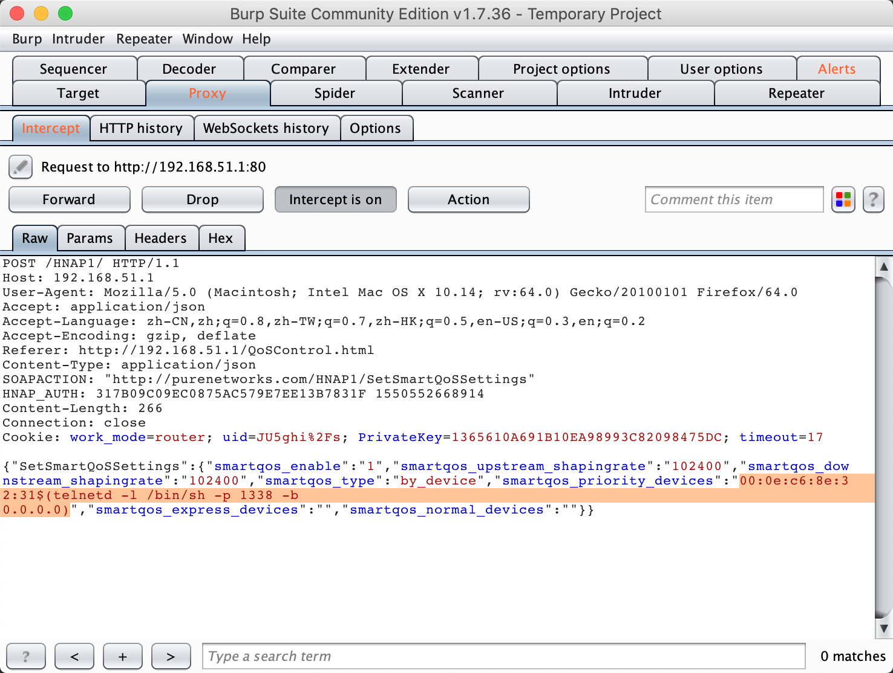
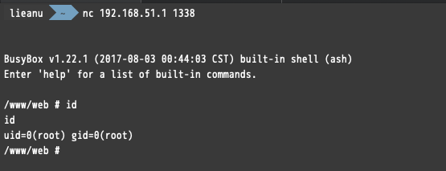

# Motorola SetStaticRouteSettings CMD Injection

Product:
* Motorola C1 (Refer: http://www.soplar.cn/moluyou.html)
* Motorola M2 (Refer: http://www.soplar.cn/moluyou.html)

Version: The latest firmware:

* C1: 1.01(Download Link: http://www.soplar.cn/download/C1.zip)
* M2: 1.07(Download Link: http://www.soplar.cn/download/M2.zip)

Vulnerability Type: Command Injection

Institution: 360 ESG / Legendsec Information Technology(Beijing)Inc..

## Vulnerability Description

A command Injection vulnerability allows attackers to execute arbitrary OS commands via a crafted /HNAP1 POST request. This occurs when any HNAP API function triggers a call to the `system` function with untrusted input from the request body for the `SetSmartQoSSettings` API function, , as demonstrated by shell metacharacters in the `smartqos_priority_devices` field

## POC

`martqos_upstream_shapingrate`, `smartqos_downstream_shapingrate`, `smartqos_priority_devices`, `smartqos_normal_devices`, `smartqos_express_devices` all these fields are vulnerable.

